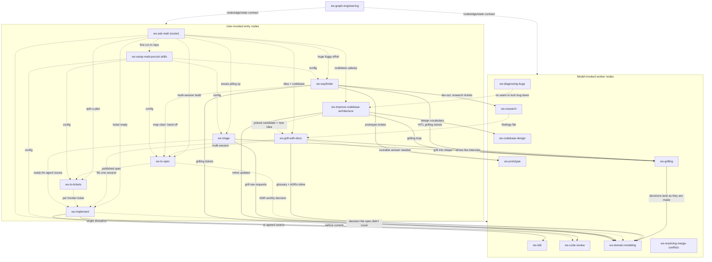

# ws-matt skill graph

The full 19-node graph of the ws plugin's ws-matt skill set: 18 skills vendored from Matt
Pocock's skills repo — 17 engineering skills + the grilling productivity skill —
plus the foundational `ws-graph-engineering` skill that
carries the node/edge/state contract every node follows. Each node's precise
contract (reads, emits, edges, handoff protocol) lives in the `## Graph node`
section at the end of its SKILL.md; this page is the map.

## Legend

- **Solid arrow** — deterministic in-session continuation (`then →`) or a
  fan-out the node performs itself.
- **Dotted arrow** — conditional (`when ... →`), user-mediated handoff, or a
  data/config edge (state written by one node and read by another).
- **Entry tier** (user-invoked): reachable only when the user types them —
  `disable-model-invocation: true` plus `disableModelInvocation: true` in
  frontmatter, `policy.allow_implicit_invocation: false` for Codex.
- **Worker tier** (model-invoked): rich trigger descriptions so the model can
  reach for them.
- **Edge rule:** entry → worker only, never entry → entry. Every dotted edge
  that lands on an entry node (including all router edges from `ws-ask-matt`)
  is a user-mediated handoff: the source node recommends the next entry node,
  the user invokes it.
- **Worker-agent fan-outs** are listed in each node's `## Graph node` section
  and are **not drawn as Mermaid nodes** — the graph above models skills only.
  The three named worker agents, fanned out via the Task tool (omp: its task
  agent):
  - **`reviewer`** — code-review worker. `ws-code-review` spawns one `reviewer`
    per axis in parallel (Standards, Spec), each returning compact findings and
    an `approve` / `request-changes` verdict per the `ws-code-review` discipline.
  - **`researcher`** — research worker. `ws-research` spawns `researcher`
    agents — one per question, fanned out in parallel when there are several —
    to investigate in the background so the caller keeps working; each returns
    a sourced summary plus a findings-file path.
  - **`tdd-runner`** — TDD worker. `ws-implement` may spawn one `tdd-runner`
    per **independent, disjoint-file red-green cycle** in parallel. Each worker
    runs exactly one `ws-tdd` cycle; the driver synthesizes after each wave,
    re-evaluates the remaining acceptance criteria, and repeats until every
    seam is complete. Dependent or overlapping cycles run sequentially via the
    `IMPL -->|"at agreed seams"| TDD` edge above. This is the execution
    mechanism behind that edge, not a separate skill node.
  - `ws-improve-codebase-architecture` / `ws-codebase-design` also spawn
    exploration and design-it-twice sub-agents (not graph nodes).
- **ADR placement (per ADR 0006).** Where a decision the spec didn't cover gets
  filed depends on scope, not on which node minted it: a **product-level ADR**
  (cross-repo, synthesized at the hub) lands in the parent hub's
  `dev-docs/decisions/` whenever a `project.yaml` is registered there; a
  **repo-specific ADR** stays in that repo's own `dev-docs/decisions/`. The
  `… -->|"…"| DM` edges show decisions landing in `ws-domain-modeling`; this
  note says where the resulting ADR is filed.
- `ws-graph-engineering` is foundational: it defines the contract (node = read
  state → emit a state delta; deterministic/conditional edges; fan-out/fan-in;
  file-handoff protocol) that every node above follows.
