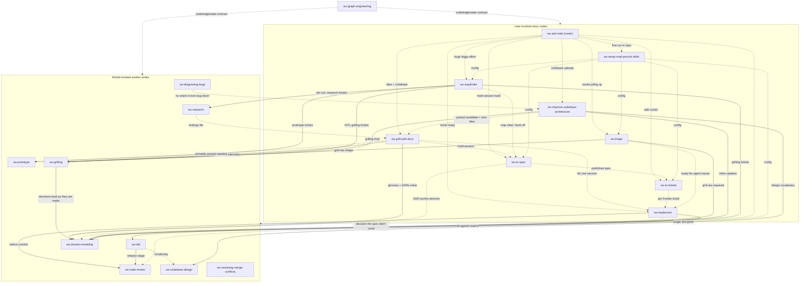

# ws-matt skill graph

The full 19-node graph of the ws plugin's ws-matt skill set: 18 skills vendored from Matt
Pocock's skills repo — 17 engineering skills + the grilling productivity skill —
plus the foundational `ws-graph-engineering` skill that
carries the node/edge/state contract every node follows. Each node's precise
contract (reads, emits, edges, handoff protocol) lives in the `## Graph node`
section at the end of its SKILL.md; this page is the map.

## Legend

- **Solid arrow** — deterministic in-session continuation (`then →`) or a
  fan-out the node performs itself.
- **Dotted arrow** — conditional (`when ... →`), user-mediated handoff, or a
  data/config edge (state written by one node and read by another).
- **Entry tier** (user-invoked): reachable only when the user types them —
  `disable-model-invocation: true` plus `disableModelInvocation: true` in
  frontmatter, `policy.allow_implicit_invocation: false` for Codex.
- **Worker tier** (model-invoked): rich trigger descriptions so the model can
  reach for them.
- **Edge rule:** entry → worker only, never entry → entry. Every dotted edge
  that lands on an entry node (including all router edges from `ws-ask-matt`)
  is a user-mediated handoff: the source node recommends the next entry node,
  the user invokes it.
- **Agent fan-outs** are listed in each node's `## Graph node` section but not
  drawn as graph nodes: `ws-code-review` spawns parallel `reviewer`
  agents (one per axis), `ws-research` runs as a background agent, and
  `ws-improve-codebase-architecture` / `ws-codebase-design` spawn exploration
  and design-it-twice sub-agents.
- `ws-graph-engineering` is foundational: it defines the contract (node = read
  state → emit a state delta; deterministic/conditional edges; fan-out/fan-in;
  file-handoff protocol) that every node above follows.
